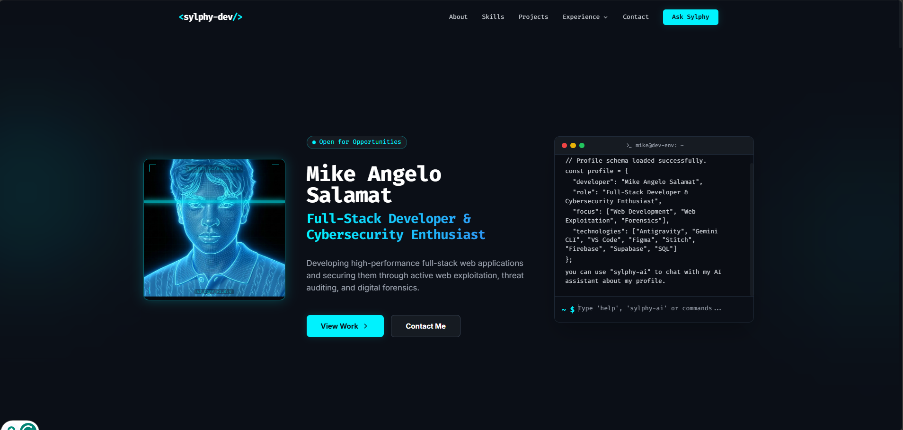

# 🚀 SALAMAT Portfolio

A high-performance, single-page professional portfolio and interactive terminal showcase. It is engineered from the ground up to present full-stack web development credentials, cybersecurity accomplishments, and AI-assisted workflows in a clean, modern interface.

[🔗 Live Demo](https://sylphy-dev-portfolio.vercel.app) | [📁 Code Repository](https://github.com/mikeymike25-lab/SALAMAT-Portfolio)

---

## 📷 Preview

<!-- Drop a crisp screenshot, mockup, or a short demo GIF right here -->


---

## ✨ Features

* **Interactive Developer Terminal:** A simulated command-line interface highlighting core specializations, available commands (e.g., `sysinfo`, `whoami`), and a live session with **Sylphy AI** (powered by Gemini).
* **Credentials & Certificates Lightbox:** An interactive, keyboard-accessible overlay modal designed to showcase AWS certifications and CTF achievements directly on the page without redirect lag.
* **Chronological Achievements Timeline:** A responsive, vertical timeline trace tracking academic records, leadership terms in **JISSA**, and participation in national tournaments.
* **Secure Stateful Contact Form:** A dynamic client-side form featuring active validation, loader transitions, and secure serverless message delivery powered by Web3Forms.

---

## 🛠️ Tech Stack

| Layer | Technologies Used |
| :--- | :--- |
| **Frontend** | React 19, Vite 8, Tailwind CSS v3, Lucide React |
| **Services / Database** | Supabase (Visits Logs / Data Storage), Web3Forms |
| **APIs / AI Tooling** | Google Gemini API (Sylphy AI Companion Integration) |

---

## 🚀 Getting Started

Follow these steps to get a local copy of the project up and running.

### Prerequisites

Ensure you have the following installed on your system:
* [Node.js](https://nodejs.org) (v18.0.0 or higher)
* [Git](https://git-scm.com/)

### Installation & Setup

1. **Clone the repository**
   ```bash
   git clone https://github.com/mikeymike25-lab/SALAMAT-Portfolio.git
   cd SALAMAT-Portfolio
   ```

2. **Configure environment variables**
   Copy the example configuration to create your local env file:
   ```bash
   cp .env.example .env
   ```
   Open the `.env` file and insert your API keys:
   ```env
   VITE_SUPABASE_URL=your_supabase_url
   VITE_SUPABASE_ANON_KEY=your_supabase_anon_key
   VITE_GEMINI_API_KEY=your_gemini_api_key
   ```

3. **Install dependencies**
   ```bash
   npm install
   ```

4. **Start the local development server**
   ```bash
   npm run dev
   ```
   Open your browser and navigate to [http://localhost:5173](http://localhost:5173).

5. **Build for production**
   To compile and optimize assets for deployment:
   ```bash
   npm run build
   ```
